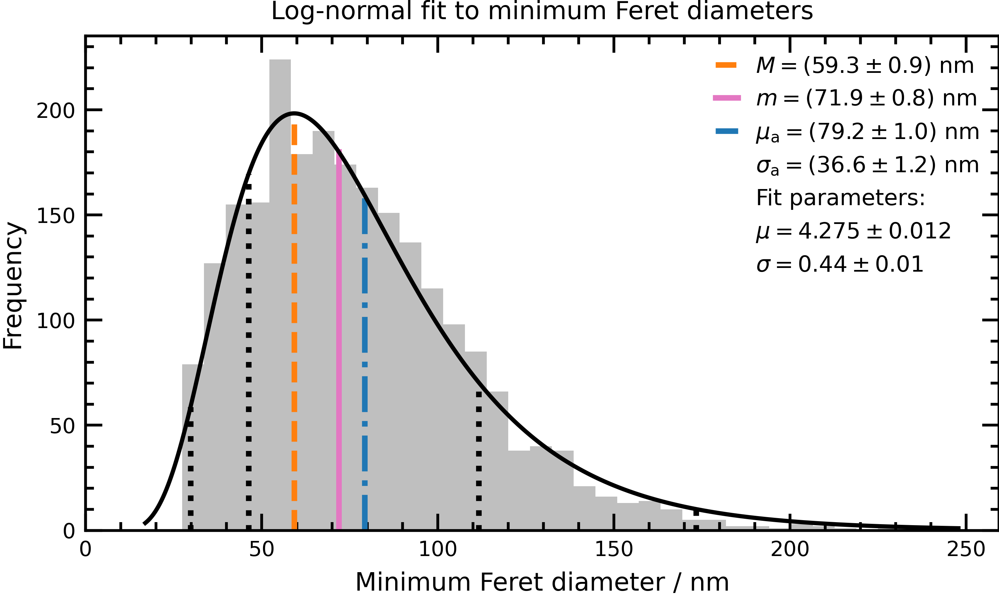

# Particle-size distribution
Jupyter notebook showing a way to fit a log-normal distribution to a histogram of a particle-size metric with Python.

# Useful Information

EU nanoparticle information PDFs:
   * [Identification of nanomaterials through measurements](https://op.europa.eu/en/publication-detail/-/publication/974431b9-1bc4-11ea-8c1f-01aa75ed71a1/language-en)
   * [New publication of the JRC about the definition of nanomaterials by the European Commission](https://etp-nanomedicine.eu/jrc-report-nanomaterial-definition/)
   * [The NanoDefine methods manual](https://op.europa.eu/en/publication-detail/-/publication/9d60fd79-4244-11ea-9099-01aa75ed71a1/language-en/format-PDF/source-search)
   
Normal or log-normal distribution? A nice paper by Limpert et al.:   
E. Limpert, W. A. Stahel, and M. Abbt, *BioScience*, **51**, (2001) 341–352, doi: [10.1641/0006-3568(2001)051](https://doi.org/10.1641/0006-3568(2001)051[0341:LNDATS]2.0.CO;2)

Try out the very useful [ParticleSizer](https://imagej.net/plugins/particlesizer) tool by [Thorsten Wagner](https://github.com/thorstenwagner).  

[Feret](https://en.wikipedia.org/wiki/Feret_diameter) vs [Ferret](https://en.wikipedia.org/wiki/Ferret) 😀
   

